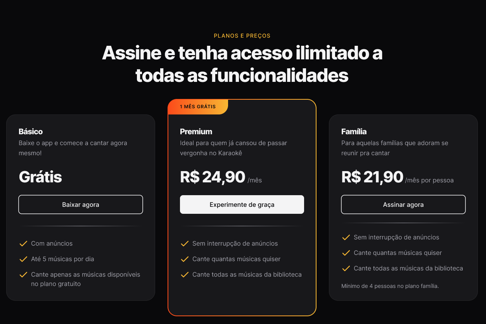
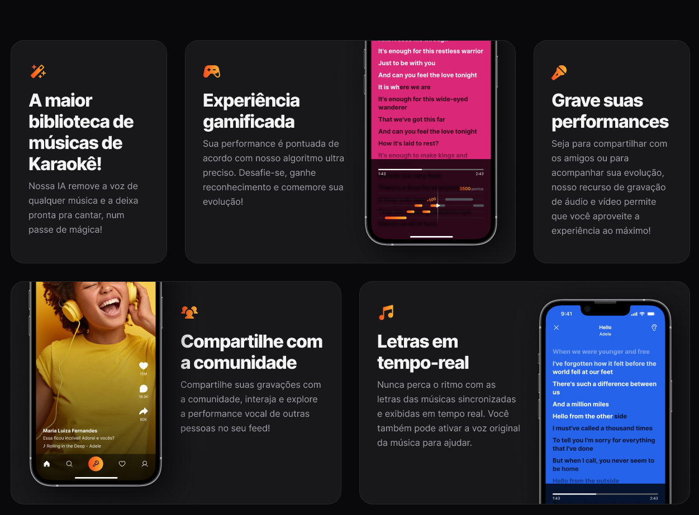
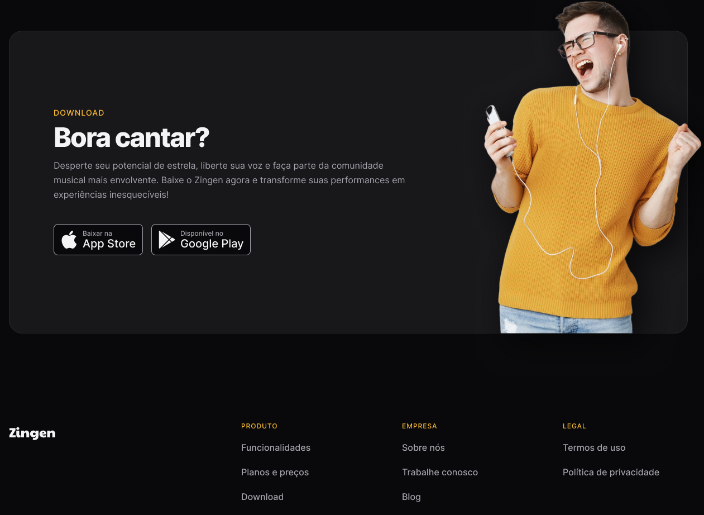

<strong><h1 align="center"></h1></strong>

## 🎨 Layout

O layout do projeto está disponível no [Figma](https://www.figma.com/design/ckg4WZEwM9bgr1SM5ApNox/LP-de-produto-(Community)-(Copy)?node-id=3-376&p=f&t=KKubJGmidOrfDLeE-0)

    
  
  
  

## 🚀 Tecnologias

Esse projeto foi desenvolvido com as seguintes tecnologias:

- HTML e CSS
- Git e Github
- Figma

## 🚀 Pré-requisitos

Antes de começar, você vai precisar ter instalado em sua máquina as seguinte ferramenta:

Feito com ♥ by [Gelzieny](https://gelzieny-portfolio.vercel.app/)
